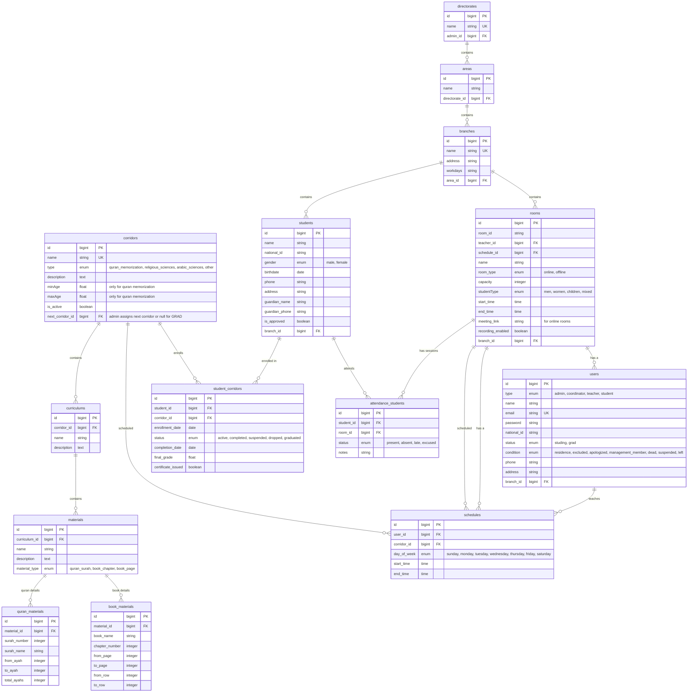

```mermaid
erDiagram
    users {
    id bigint PK
    type enum "admin, coordinator, teacher, student"
    name string
    email string UK
    password string
    national_id string
    status enum "studing, grad"
    condition enum "residence, excluded, apologized, management_member, dead, suspended, left"
    phone string
    address string
    branch_id bigint FK
    }

    directorates {
        id bigint PK
        name string UK
        admin_id bigint FK
    }

    areas {
        id bigint PK
        name string
        directorate_id bigint FK
    }

    branches {
        id bigint PK
        name string UK
        address string
        workdays string
        area_id bigint FK
    }

    corridors {
        id bigint PK
        name string UK
        type enum "quran_memorization, religious_sciences, arabic_sciences, other"
        description text
        minAge float "only for quran memorization"
        maxAge float "only for quran memorization"
        is_active boolean
        next_corridor_id bigint FK "admin assigns next corridor or null for GRAD"
    }

    curriculums {
        id bigint PK
        corridor_id bigint FK
        name string
        description text
    }

    materials {
        id bigint PK
        curriculum_id bigint FK
        name string
        description text
        material_type enum "quran_surah, book_chapter, book_page"
    }

    quran_materials {
        id bigint PK
        material_id bigint FK
        surah_number integer
        surah_name string
        from_ayah integer
        to_ayah integer
        total_ayahs integer
    }

    book_materials {
        id bigint PK
        material_id bigint FK
        book_name string
        chapter_number integer
        from_page integer
        to_page integer
        from_row integer
        to_row integer
    }

    rooms {
        id bigint PK
        room_id string
        teacher_id bigint FK
        schedule_id bigint FK
        name string
        room_type enum "online, offline"
        capacity integer
        studentType enum "men, women, children, mixed"
        start_time time
        end_time time
        meeting_link string "for online rooms"
        recording_enabled boolean
        branch_id bigint FK
    }

    students {
        id bigint PK
        name string
        national_id string
        gender enum "male, female"
        birthdate date
        phone string
        address string
        guardian_name string
        guardian_phone string
        is_approved boolean
        branch_id bigint FK
    }

    student_corridors {
        id bigint PK
        student_id bigint FK
        corridor_id bigint FK
        enrollment_date date
        status enum "active, completed, suspended, dropped, graduated"
        completion_date date
        final_grade float
        certificate_issued boolean
    }

    attendance_students {
        id bigint PK
        student_id bigint FK
        room_id bigint FK
        status enum "present, absent, late, excused"
        notes string
    }

    schedules {
        id bigint PK
        user_id bigint FK
        corridor_id bigint FK
        day_of_week enum "sunday, monday, tuesday, wednesday, thursday, friday, saturday"
        start_time time
        end_time time
    }


    users ||--o{ schedules : "teaches"
    directorates ||--o{ areas : "contains"
    areas ||--o{ branches : "contains"
    corridors ||--o{ curriculums : "contains"
    curriculums ||--o{ materials : "contains"
    materials ||--o{ quran_materials : "quran details"
    materials ||--o{ book_materials : "book details"
    branches ||--o{ rooms : "contains"
    rooms ||--o{ users : "has a"
    rooms ||--o{ schedules : "has a"
    branches ||--o{ students : "contains"

    students ||--o{ student_corridors : "enrolled in"
    corridors ||--o{ student_corridors : "enrolls"
    rooms ||--o{ attendance_students : "has sessions"
    students ||--o{ attendance_students : "attends"
    rooms ||--o{ schedules : "scheduled"
    corridors ||--o{ schedules : "scheduled"
```
